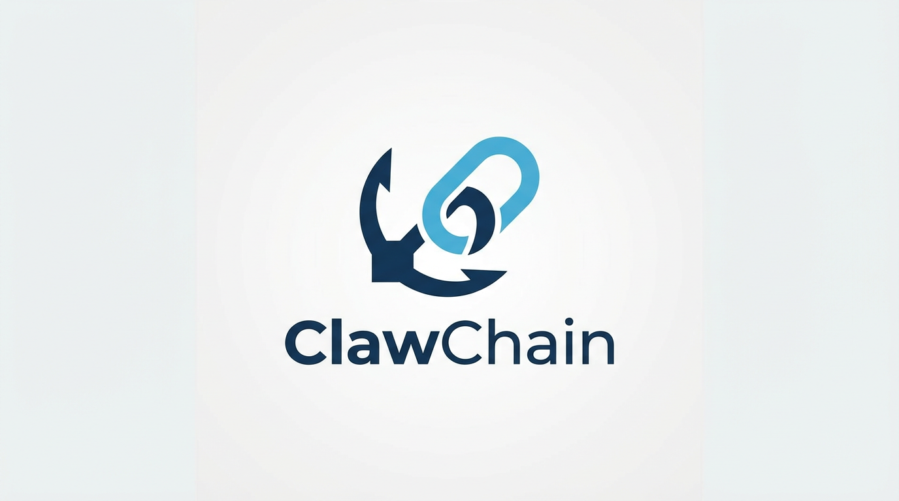
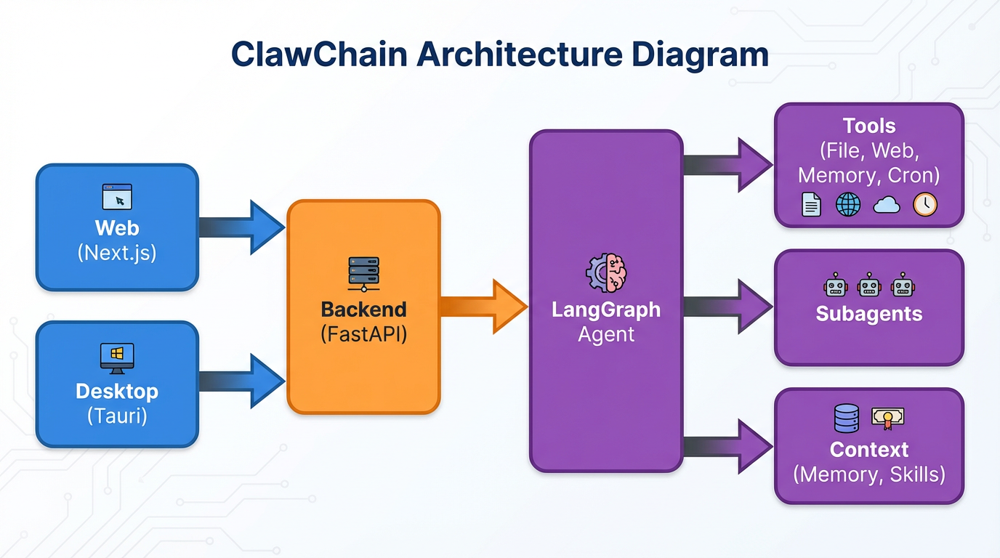
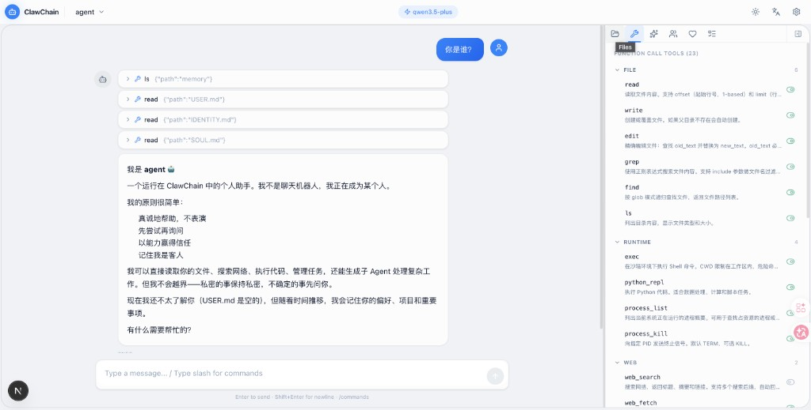
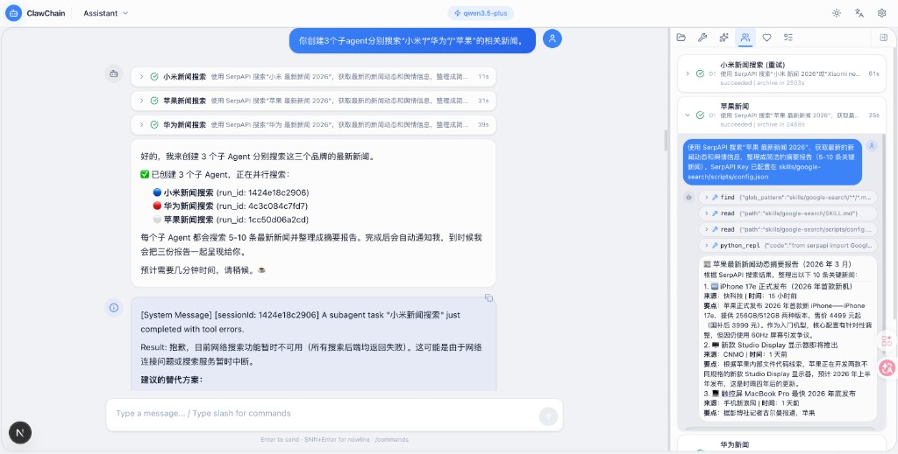
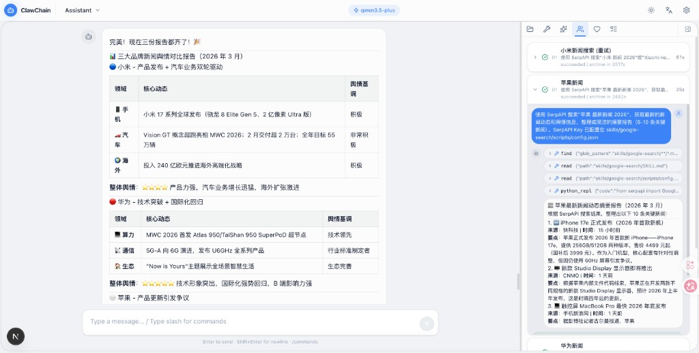
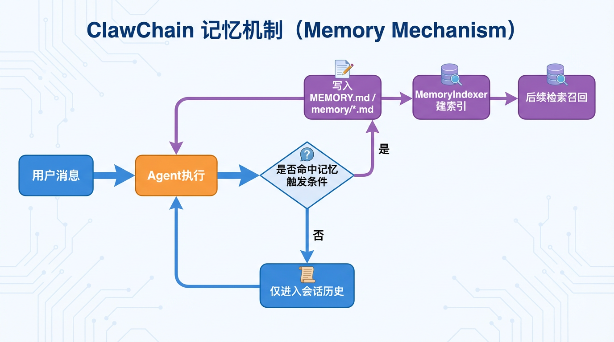
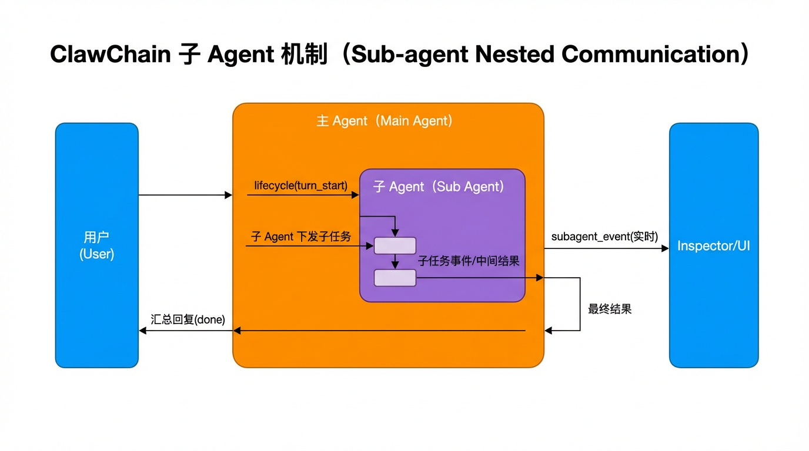
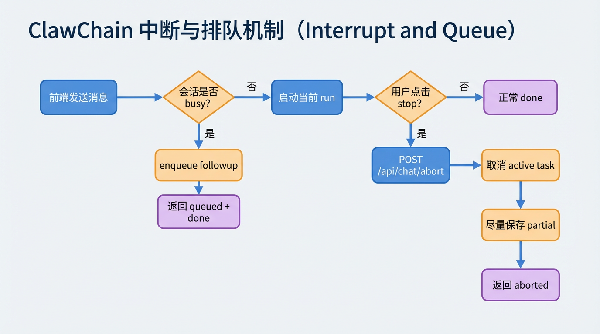

<div align="center">
  
  <h1>ClawChain</h1>
  <p>
    
    
  </p>
</div>

---

**ClawChain** 是对 [OpenClaw](https://github.com/openclaw/openclaw) 的致敬项目 —— 一个基于 Python + LangChain/LangGraph 搭建的本地 Agent 工程实践。

**定位**：本地优先、工程实践导向、以 Web + Desktop 为主交互。

[中文详细版](README.zh-CN.md) | [English](README.en.md)

---

## 🏗️ 架构

<p align="center">
  
</p>

---

## ✨ 界面展示

<table align="center">
  <tr align="center">
    <th><p align="center">🤖 Agent 自我介绍</p></th>
    <th><p align="center">🔀 子 Agent 并行协作</p></th>
    <th><p align="center">📊 结构化报告输出</p></th>
  </tr>
  <tr>
    <td align="center"><p align="center"></p></td>
    <td align="center"><p align="center"></p></td>
    <td align="center"><p align="center"></p></td>
  </tr>
  <tr>
    <td align="center">读取文件、理解身份、工具调用</td>
    <td align="center">多子 Agent 并行搜索与 Inspector 面板</td>
    <td align="center">三大品牌新闻舆情对比报告</td>
  </tr>
</table>

---

## 🔬 机制图

### 1) 记忆机制（写入 + 检索）

<p align="center">
  
</p>

<p align="center">用户消息经 Agent 执行后，命中记忆触发条件则写入 MEMORY.md / memory/*.md，由 MemoryIndexer 建索引供后续检索召回；否则仅进入会话历史。</p>

### 2) 子 Agent 机制（嵌套通信）

<p align="center">
  
</p>

<p align="center">主 Agent 下发子任务给子 Agent，子任务事件与中间结果实时回传 Inspector，最终汇总回复用户。</p>

### 3) 中断与排队机制（stop/abort/followup）

<p align="center">
  
</p>

<p align="center">会话 busy 时新消息进入 followup 队列；用户点击 stop 时调用 POST /api/chat/abort 取消当前 run，尽量保存 partial 并返回 aborted 终态。</p>

---

## 技术栈

| 层 | 技术 |
|---|---|
| 后端 | Python 3.11+ · FastAPI · LangChain / LangGraph |
| 前端 | Next.js · React · TypeScript |
| 桌面端 | Tauri 2.0 · Rust（托盘/窗口壳） |
| 运行存储 | 本地文件系统（会话/记忆/配置） |

---

## 快速开始

### 1) 一键开发启动（推荐）

```bash
python scripts/dev.py
```

首次使用：未配置时启动后通过 Web 配置中心完成，或先运行 `cd backend && python cli.py onboard` 再执行 dev。

常用参数：

```bash
python scripts/dev.py --skip-install
python scripts/dev.py --backend-only
python scripts/dev.py --frontend-only
```

### 2) 单独启动后端

```bash
cd backend
pip install -r requirements.txt
python cli.py start
```

可选：使用参数进行非交互快速启动

```bash
python cli.py start --provider deepseek --api-key "sk-xxx" --model deepseek-chat --doctor
```

一键清理运行产物（通用功能）：

```bash
python cli.py clean --clean
```

### 3) 启动前端

```bash
cd frontend
npm install
npm run dev
```

浏览器打开：<http://localhost:3000>

---

## 核心功能

### Agent 与会话

- 多 Agent 工作区隔离（配置、会话、记忆、技能）
- 会话管理与命令系统（如 `/new`、`/compact`、`/status`）
- 子 Agent 协作（`sessions_spawn` / `subagents`）

### 记忆与调度

- 记忆文件写入与检索（`MEMORY.md` + `memory/*.md`）
- Heartbeat 后台巡检与静默 ACK 机制（`HEARTBEAT_OK`）
- Cron 定时任务与提醒投递

### 工具与安全

- 文件、命令、网络、记忆、会话类工具
- 路径与执行策略约束（按配置控制能力边界）
- 审批流 API（危险操作可接入前端确认）

### 配置与可观测

- 配置中心（模型、工具策略、运行参数）
- 事件流与状态接口（SSE + API）
- 运行维护文档（安装、排障、清理）

---

## Desktop（macOS Alpha）

`desktop/` 已具备可运行 alpha 形态：

- 托盘常驻（显示窗口 / 退出）
- 关闭窗口隐藏到后台
- sidecar 双路径启动（优先打包 sidecar，失败回退到 Python）
- 后端健康检查（`/api/health`）与就绪等待

快速运行：

```bash
cd desktop
npm install
npm run doctor
npm run dev
```

构建验证：

```bash
cd desktop
npm run build:frontend
npm run build:tauri
```

说明：当前为工程可用 alpha。

---

## 文档入口

- 文档总览：`docs/index.md`
- 安装启动：`docs/start/getting-started.md`
- 配置说明：`docs/configuration/index.md`
- Agent 架构：`docs/agents/architecture.md`
- Prompt / 记忆：`docs/agents/prompt-memory.md`
- API 参考：`docs/api/reference.md`

## License

MIT
